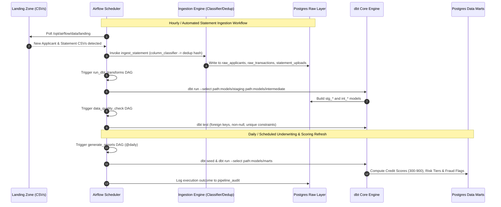
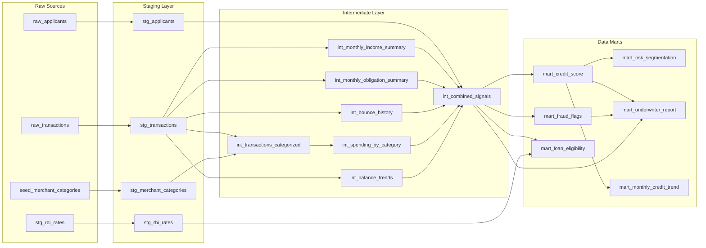

# LoanLens

**Automated loan eligibility and credit scoring platform for Indian NBFCs.**

LoanLens is a full-stack data engineering + web application that accepts bank statement CSVs from any Indian bank, processes them through a universal ingestion pipeline, computes credit scores and loan eligibility using dbt transforms, and surfaces the results to analysts, managers, and applicants through a role-scoped React frontend.

---

## Table of Contents

- [App Architecture](#app-architecture)
  - [System Overview](#system-overview)
  - [Full System Architecture (Data Lineage)](#full-system-architecture-data-lineage)
  - [Airflow DAG Execution Lifecycle](#airflow-dag-execution-lifecycle)
  - [dbt Data Lineage (Column-Level Flow)](#dbt-data-lineage-column-level-flow)
  - [Data Layer — PostgreSQL + dbt](#data-layer--postgresql--dbt)
  - [Orchestration — Apache Airflow](#orchestration--apache-airflow)
  - [Role-Based Access Control](#role-based-access-control)
- [Data Engineering Architecture](#data-engineering-architecture)
- [Running the Project (Local Dev)](#running-the-project-local-dev)
- [Service URLs](#service-urls)

---

## App Architecture

### System Overview

```
+-------------------------+     HTTPS/REST     +---------------------------+
|   React Frontend        |<------------------>|   FastAPI Backend         |
|   (Vite, TypeScript)    |                    |   (Python 3.12, asyncio)  |
|   port 5173             |                    |   port 8000               |
+-------------------------+                    +---------------------------+
                                                        |
                          +-----------------------------+-----------------------------+
                          |                             |                             |
                  +-------+-------+           +---------+------+           +----------+-----+
                  |  PostgreSQL   |           | Apache Airflow |           |   Metabase     |
                  |  (port 5432)  |           | (port 8080)    |           |  (port 3000)   |
                  |               |           |                |           |                |
                  |  raw layer    |           |  5 DAGs        |           |  BI dashboards |
                  |  dbt marts    |           |  hourly ingest |           |  connected to  |
                  |  auth tables  |           |  dbt triggers  |           |  PostgreSQL    |
                  +---------------+           +----------------+           +----------------+
```

### Full System Architecture (Data Lineage)

End-to-end flow from landing zone → Airflow orchestration → PostgreSQL layers → dbt transforms → FastAPI → React/Metabase:

```mermaid
flowchart TD
    subgraph Landing["1. Data Ingestion & Landing Zone"]
        CSV_App["Applicants CSV\n(/data/landing/applicants)"]
        CSV_Txn["Bank Statement CSVs\n(/data/landing/transactions)"]
        RBI_Src["RBI Rates Source\n(Repo, MSF, Loan Benchmarks)"]
    end

    subgraph Airflow["2. Orchestration Layer (Apache Airflow)"]
        DAG_Ingest["ingest_statements\n(Hourly Schedule)"]
        DAG_RBI["ingest_rbi_rates\n(Weekly Schedule)"]
        DAG_Transforms["run_dbt_transforms\n(Triggered post-ingest)"]
        DAG_Quality["data_quality_check\n(Triggered post-transform)"]
        DAG_Reports["generate_reports\n(Daily @midnight)"]
        AuditLog["pipeline_audit Table\n(Execution & Rows Audit)"]
    end

    subgraph Database["3. PostgreSQL Data Warehouse & Modeling Layers"]
        subgraph RawLayer["Raw Data Layer"]
            RAW_App["raw_applicants"]
            RAW_Txn["raw_transactions"]
            RAW_Uploads["statement_uploads"]
            RAW_Reg["format_registry"]
            RAW_Log["landing_ingest_log"]
        end

        subgraph StagingLayer["dbt Staging Layer"]
            STG_App["stg_applicants"]
            STG_Txn["stg_transactions"]
            STG_Merch["stg_merchant_categories"]
            STG_RBI["stg_rbi_rates"]
        end

        subgraph IntermediateLayer["dbt Intermediate Signal Layer"]
            INT_Txn["int_transactions_categorized"]
            INT_Inc["int_monthly_income_summary"]
            INT_Obl["int_monthly_obligation_summary"]
            INT_Bnc["int_bounce_history"]
            INT_Spd["int_spending_by_category"]
            INT_Bal["int_balance_trends"]
            INT_Sig["int_combined_signals"]
        end

        subgraph MartsLayer["dbt Data Marts Analytical Layer"]
            MART_Credit["mart_credit_score"]
            MART_Fraud["mart_fraud_flags"]
            MART_Elig["mart_loan_eligibility"]
            MART_Risk["mart_risk_segmentation"]
            MART_Report["mart_underwriter_report"]
            MART_Trend["mart_monthly_credit_trend"]
            MART_Audit["mart_pipeline_audit"]
            MART_Decisions["decisions"]
        end
    end

    subgraph Consumption["4. Application & Presentation Layer"]
        API["FastAPI Backend\n(REST APIs & Underwriting Service)"]
        Portal["Applicant Portal UI\n(Score, Breakdown, Statements)"]
        Queue["Underwriter Queue UI\n(Risk Tiers, Decision Overrides)"]
        Metabase["Metabase BI\n(Executive Analytics & Dashboards)"]
    end

    CSV_App & CSV_Txn --> DAG_Ingest
    RBI_Src --> DAG_RBI

    DAG_Ingest --> RAW_App & RAW_Txn & RAW_Uploads & RAW_Log
    DAG_RBI --> STG_RBI
    DAG_Ingest -->|Trigger| DAG_Transforms

    DAG_Transforms -->|dbt run staging| STG_App & STG_Txn & STG_Merch
    DAG_Transforms -->|Trigger| DAG_Quality
    DAG_Quality -->|dbt test| STG_App & STG_Txn & STG_RBI

    DAG_Reports -->|dbt run marts| INT_Txn & INT_Inc & INT_Obl & INT_Bnc & INT_Spd & INT_Bal & INT_Sig
    INT_Sig --> MART_Credit & MART_Fraud & MART_Elig & MART_Risk & MART_Report & MART_Trend

    DAG_Ingest & DAG_RBI & DAG_Transforms & DAG_Quality & DAG_Reports -.->|Audit Logging| AuditLog
    AuditLog --> MART_Audit

    MartsLayer --> API
    API --> Portal & Queue & MART_Decisions
    MartsLayer --> Metabase
```



### Airflow DAG Execution Lifecycle



### dbt Data Lineage (Column-Level Flow)



#### Middleware Stack

```
Request
  --> CORS middleware (configurable allowed origins)
  --> Rate limiter (slowapi, per-IP)
  --> Request logger (structured JSON logs, latency_ms)
  --> Route handler
  --> Response
```

---

### Data Layer — PostgreSQL + dbt

#### Raw Layer (written by FastAPI + Airflow)

| Table | Purpose |
|---|---|
| `users` | Authentication: email, bcrypt password hash, role |
| `raw_applicants` | Applicant KYC data linked to a `user_id` |
| `raw_loan_applications` | Loan applications (type, amount, purpose, status) |
| `raw_transactions` | Canonical transaction rows from all uploaded statements |
| `statement_uploads` | File-level upload metadata (hash, reconciliation verdict) |
| `format_registry` | Known bank CSV format cache (header set -> column mapping) |
| `format_review_queue` | Rejected/warned uploads awaiting human review |
| `decisions` | Append-only human underwriter decision log (approved/rejected/escalated) — also exposed as the `decisions` dbt mart |
| `audit_log` | Every mutation with old/new values (JSONB) |
| `loan_type_config` | Per-loan-type thresholds: min_score, max_amount, escalation bands |
| `rbi_rates` | RBI repo rate (ingested by Airflow DAG) |

#### dbt Transform Layer (read by FastAPI)

```
Staging (stg_*)
  stg_transactions          -- type-cast + normalise raw_transactions
  stg_applicants            -- cast raw_applicants
  stg_rbi_rates             -- expose current repo rate
  stg_merchant_categories   -- keyword-to-category seed table

Intermediate (int_*)
  int_transactions_categorized   -- merchant category per transaction
  int_monthly_income_summary     -- monthly salary/income aggregates
  int_monthly_obligation_summary -- monthly EMI outflows
  int_balance_trends             -- month-over-month balance trends
  int_bounce_history             -- ECS bounce / cheque dishonour events
  int_spending_by_category       -- spend aggregated by category + month
  int_combined_signals           -- unified per-applicant signal row

Marts (mart_*)
  mart_credit_score          -- credit score 300-900 with component breakdown
  mart_loan_eligibility      -- eligible amount per loan type per applicant
  mart_fraud_flags           -- fraud signal flags
  mart_monthly_credit_trend  -- monthly credit health time series
  mart_risk_segmentation     -- risk tier: low / medium / high
  mart_underwriter_report    -- flat underwriter summary row
  mart_pipeline_audit        -- DAG run history: rows_processed, status, failures
  decisions                  -- human underwriter decision log (approved/rejected/escalated)
```

---

### Orchestration — Apache Airflow

Airflow runs in **LocalExecutor** mode (no Redis/Celery worker needed).

| DAG | Schedule | What it does |
|---|---|---|
| `ingest_statements` | `@hourly` | Reads CSVs from landing zone, runs ingestion pipeline, bulk-inserts to raw_transactions, triggers dbt |
| `run_dbt_transforms` | Triggered (post-ingest) | Runs `dbt run` for staging + intermediate models, triggers data_quality_check |
| `data_quality_check` | Triggered (post-transform) | Runs `dbt test` assertions |
| `generate_reports` | `@daily` (midnight) | Recomputes marts: credit scores, eligibility, risk, fraud flags |
| `ingest_rbi_rates` | `@weekly` | Refreshes RBI benchmark rates (repo, MSF, loan benchmarks) into `stg_rbi_rates` |

All five DAGs log execution outcome (`run_id`, `rows_processed`, `status`, `failures`) to the `pipeline_audit` table, which is surfaced as `mart_pipeline_audit`.

---

### Role-Based Access Control

| Role | Who | What they can do |
|---|---|---|
| `applicant` | Loan applicants | Upload bank statements, submit loan applications, view their own status and credit score |
| `analyst` | Credit officers | View applicant queue, read credit scores, approve/reject applications (within score bands), escalate to manager |
| `manager` | Senior officers | Handle escalated applications, approve high-value loans, view reports, escalate to admin |
| `admin` | Platform admins | Full user management, loan type configuration, audit log access, admin overrides on any application |

---

## Data Engineering Architecture

LoanLens processes bank statement CSVs from any bank using a universal ingestion pipeline that operates with **zero bank-name branching** in the code. Below is the detailed architecture of the data engineering component.

### 1. Overview & Design Philosophy

LoanLens ingests bank statement CSVs from **any** Indian bank without needing a handwritten parser per bank. The pipeline is built on three guarantees:

| Guarantee | Mechanism |
|---|---|
| **No hardcoded bank names** | Column mapping is derived entirely from header keywords + value statistics |
| **Balance reconciliation is the truth signal** | Any real bank statement satisfies `balance[i] = balance[i-1] +/- amount[i]`; failing this check means the mapping is wrong |
| **Idempotent at every level** | File-level SHA-256 + row-level UUID5 make re-running the same upload a no-op |

### 2. End-to-End Pipeline Topology

```
                          +-----------------------------------------+
                          |  INPUT SURFACE                          |
                          |                                         |
          Applicant       |  POST /api/v1/upload/bank-statement     |
          uploads CSV --->|  (FastAPI, authenticated JWT)           |
                          |  5 MB size cap, .csv only               |
                          +--------------------+--------------------+
                                               |
                                               | raw bytes
                                               v
                          +-----------------------------------------+
                          |  INGESTION PIPELINE                     |
                          |  backend/app/ingestion/pipeline.py      |
                          |                                         |
                          |  Step 0.  SHA-256 file hash             |
                          |            duplicate? --> 409           |
                          |                                         |
                          |  Step 1.  UTF-8-sig / Latin-1 decode    |
                          |                                         |
                          |  Step 2.  Header-row detection          |
                          |            scan first 30 lines          |
                          |            for >= 2 keyword hits        |
                          |                                         |
                          |  Step 3.  Minimum row check (< 3 -> 422)|
                          |                                         |
                          |  Step 4.  Format registry lookup        |
                          |            HIT  -> use stored mapping   |
                          |                   (confidence = 1.0)   |
                          |            MISS -> column_classifier    |
                          |                                         |
                          |  Step 5.  Confidence gate               |
                          |            < 0.55 -> reject + queue     |
                          |                                         |
                          |  Step 6.  Canonical resolution          |
                          |            flagged pattern              |
                          |            split pattern                |
                          |            signed pattern               |
                          |                                         |
                          |  Step 7.  Unparse-rate gate             |
                          |            > 10% failures -> reject     |
                          |                                         |
                          |  Step 8.  Balance reconciliation        |
                          |            pass  (>= 98%) -> continue   |
                          |            warn  (85-98%) -> flag       |
                          |            fail  (< 85%) -> reject      |
                          |                                         |
                          |  Step 9.  UUID5 raw_id attachment       |
                          +--------------------+--------------------+
                                               |
                                               | canonical rows
                                               v
                          +-----------------------------------------+
                          |  RAW LAYER -- PostgreSQL                |
                          |                                         |
                          |  raw_transactions                       |
                          |    ON CONFLICT (raw_id) DO NOTHING      |
                          |                                         |
                          |  statement_uploads                      |
                          |    (file-level metadata)                |
                          |                                         |
                          |  format_review_queue                    |
                          |    (on reject/warn)                     |
                          +--------------------+--------------------+
                                               |
                                               |  hourly (Airflow)
                                               v
                          +-----------------------------------------+
                          |  TRANSFORM LAYER -- dbt                 |
                          |                                         |
                          |  Staging                                |
                          |    stg_transactions                     |
                          |    stg_applicants                       |
                          |    stg_rbi_rates                        |
                          |    stg_merchant_categories              |
                          |                                         |
                          |  Intermediate                           |
                          |    int_transactions_categorized         |
                          |    int_monthly_income_summary           |
                          |    int_monthly_obligation_summary       |
                          |    int_balance_trends                   |
                          |    int_bounce_history                   |
                          |    int_spending_by_category             |
                          |    int_combined_signals                 |
                          |                                         |
                          |  Marts                                  |
                          |    mart_credit_score                    |
                          |    mart_loan_eligibility                |
                          |    mart_fraud_flags                     |
                          |    mart_monthly_credit_trend            |
                          |    mart_risk_segmentation               |
                          |    mart_underwriter_report              |
                          +-----------------------------------------+
```

### 3. Ingestion Layer

All ingestion logic lives in `backend/app/ingestion/`. The orchestrator is `pipeline.py`; it calls the other three modules in sequence.

#### 3.1 Step 0 — File-Level Deduplication

**Module:** `dedup.py -> file_hash()`

Before any parsing happens, the raw bytes are hashed with **SHA-256**:

```python
def file_hash(raw_bytes: bytes) -> str:
    return hashlib.sha256(raw_bytes).hexdigest()
```

The hash is checked against `statement_uploads(applicant_id, file_hash)` — a composite unique constraint enforced at the DB level. If the exact same file was previously uploaded by the same applicant, the pipeline returns `STATUS_DUPLICATE_FILE` immediately with no DB writes.

**Why SHA-256 and not MD5?** SHA-256 is collision-resistant; an adversary cannot produce a different file with the same hash to bypass duplicate detection.

#### 3.2 Step 1 — Encoding Detection & Header-Row Scan

**Module:** `pipeline.py -> ingest_statement()`, `column_classifier.py -> detect_header_row()`

##### Encoding

Banks export CSVs in different encodings. The pipeline tries `utf-8-sig` first (handles BOM from Excel), falls back to `latin-1`. If neither works it returns `STATUS_NOT_A_BANK_STATEMENT`.

##### Header-Row Detection

Many Indian bank exports prepend metadata rows before the actual column headers (e.g., account number, branch, date range). The detector scans the **first 30 lines** looking for the first line that scores **>= 2 header keyword hits**:

```
ALL_HEADER_KEYWORDS = {
    date, txn_date, transaction date, value date, posting date, ...
    amount, withdrawal, deposit, txn amount, ...
    debit, dr, withdrawal amt, ...
    credit, cr, deposit amt, ...
    balance, closing balance, running balance, bal, ...
    description, narration, particulars, remarks, ...
    type, txn_type, cr/dr, dr/cr, drcr, ...
}
```

Each candidate line is tokenised, normalised (underscores/slashes to spaces), and matched using word-boundary regex. The first line with >= 2 keyword hits is the header row. Everything above it is discarded before CSV parsing.

#### 3.3 Step 2 — Format Registry Fast Path

**Module:** `pipeline.py`, DB table `format_registry`

After parsing the CSV, the detected column-name set (lowercased, stripped) is turned into a `frozenset`. This key is looked up in `format_registry`:

```sql
SELECT match_headers, column_map, amount_pattern FROM format_registry
```

**Registry hit:** The stored `column_map` JSON is deserialized into a `ColumnMapping` with `confidence = 1.0` (human-confirmed). The heuristic classifier is **bypassed entirely**.

**Registry miss:** Falls through to the column classifier.

The registry is a **performance optimisation, not a correctness requirement**. Removing all registry entries degrades throughput but never breaks ingestion — every file simply goes through the heuristic path.

#### 3.4 Step 3 — Column Classifier Heuristic Path

**Module:** `column_classifier.py -> classify_columns()`

This is the core innovation. Given a `pandas.DataFrame` with unknown column headers, the classifier assigns each column to one of **six canonical roles** using a two-component score:

```
score = 0.5 * header_score + 0.5 * value_content_score
```

##### Scoring Functions

| Function | What it measures |
|---|---|
| `_keyword_score(col, kw_set)` | Exact match = 1.0; substring match = 0.7; no match = 0.0 |
| `_date_parse_rate(series)` | Fraction of first 50 non-null values parseable as dates |
| `_numeric_parse_rate(series)` | Fraction parseable as a number (strips commas, parentheses) |
| `_type_flag_rate(series)` | Fraction that look like DR, CR, Debit, Credit variants |

##### Classification Order (guardrails matter)

The classifier follows a strict priority order to avoid role conflicts:

1. **`txn_date`** — claimed first (unique role, highest confidence needed)
2. **`balance_after`** — claimed **before** amount scoring to prevent the balance column from being mistaken for an amount column. Requires a keyword component > 0 (a bare numeric column cannot become the balance column)
3. **`txn_type`** — tentatively found (used to detect `flagged` pattern)
4. **Amount pattern resolution** — three patterns tried in priority order:
   - **`flagged`**: one amount column + a txn_type column (DR/CR flag). Requires `type_score >= 0.45`
   - **`split`**: separate debit column + credit column (both sparse-numeric). Requires both `debit_score >= 0.3` and `credit_score >= 0.3`
   - **`signed`**: single signed-numeric column (positive = credit, negative = debit). Fallback
5. **`description`** — all remaining unclaimed columns with score >= 0.25 are collected and coalesced left-to-right at row resolution time

##### Output: ColumnMapping

```python
@dataclass
class ColumnMapping:
    txn_date_col:      Optional[str]
    amount_cols:       list[str]   # [debit, credit] | [amount] | [amount]
    txn_type_col:      Optional[str]   # only for 'flagged' pattern
    description_cols:  list[str]       # coalesced left-to-right
    balance_col:       Optional[str]
    amount_pattern:    str             # 'flagged' | 'split' | 'signed'
    confidence:        float           # min of all role scores used
```

`confidence` = minimum of all role scores that contributed to the mapping. This is a conservative estimate — if any role is poorly identified, the whole mapping's confidence drops.

#### 3.5 Step 4 — Confidence Gate

**Module:** `pipeline.py`

Two gates apply only on the **heuristic path** (registry-resolved mappings bypass both):

| Gate | Threshold | Action |
|---|---|---|
| Column-mapping confidence | < 0.55 | Return `STATUS_LOW_CONFIDENCE`, write `format_review_queue` |
| Core-field unparse rate | > 10% | Return `STATUS_LOW_CONFIDENCE`, write `format_review_queue` |

A sanity check applies on **both** paths: if no `txn_date` or no `amount_cols` were resolved, return `STATUS_NOT_A_BANK_STATEMENT` immediately.

#### 3.6 Step 5 — Canonical Resolution

**Module:** `pipeline.py -> _resolve_canonical_rows()`

Each raw DataFrame row is converted into a canonical dict with fixed fields. This is where the three amount patterns diverge:

**`flagged` pattern** (e.g., Axis Bank, HDFC with DR/CR column):
```
amount   = parse(amount_col)      # always positive
txn_type = normalise(type_col)    # "DR" -> "debit", "CR" -> "credit"
```

**`split` pattern** (e.g., SBI, Kotak with separate Debit/Credit columns):
```
debit_val  = parse(debit_col)
credit_val = parse(credit_col)
if credit_val > 0: amount=credit_val, txn_type="credit"
else:              amount=debit_val,  txn_type="debit"
Rows where both are 0/null are skipped (summary rows)
```

**`signed` pattern** (single amount column, negative = debit):
```
signed_val = Decimal(raw)
amount   = abs(signed_val)
txn_type = "credit" if signed_val >= 0 else "debit"
```

**Description coalescing:** Multiple description columns are tried left-to-right; the first non-empty value wins.

**Date parsing:** 10 format strings tried in order: ISO, DD-MM-YYYY, DD/MM/YYYY, DD-Mon-YYYY, DD.MM.YYYY, MM/DD/YYYY, and short-year variants.

**Amount normalisation:** Commas stripped, parenthetical annotations removed (e.g., `"12,345.00 (Low Balance)"` -> `Decimal("12345.00")`). All amounts stored as **positive values**; direction is encoded in `txn_type`.

The canonical schema produced per row:
```
txn_date          date
amount            Decimal (always positive)
txn_type          "debit" | "credit"
description       str
balance_after     Decimal | None
source_format     "heuristic:split" | "registry:flagged" | ...
source_file_hash  sha256 hex
```

#### 3.7 Step 6 — Balance Reconciliation

**Module:** `reconcile.py -> reconcile()`

This is the **correctness oracle** for the mapping. Any real bank statement satisfies:

```
balance_after[i] == balance_after[i-1] +/- amount[i]
```

##### Algorithm

1. **Stable sort** by `txn_date` using `kind="mergesort"` — preserves same-day file order. Critical because balance is a running total; an unstable sort produces false mismatches on same-day batches
2. Compute signed delta per row: `+amount` for credit, `-amount` for debit
3. Compute `expected_balance = prev_balance + delta` for rows 2..N (first row has no predecessor)
4. Count rows where `|actual_balance - expected_balance| <= 0.01`
5. `match_rate = matched_rows / checked_rows`

##### Verdicts

| Verdict | Condition | Action |
|---|---|---|
| `pass` | match_rate >= 0.98 | Continue normally |
| `warn` | 0.85 <= match_rate < 0.98 | Accept rows, store with `needs_review` flag, write `format_review_queue` |
| `fail` | match_rate < 0.85 | Reject entire upload, write `format_review_queue` |
| `insufficient_data` | < 2 rows with balance | Skip check (no error) |

The mismatch sample (up to 5 rows) surfaces `txn_date`, `amount`, `txn_type`, `actual_balance`, `expected_balance`, and `diff` to the review queue for debugging.

#### 3.8 Step 7 — Row-Level Deduplication

**Module:** `dedup.py -> attach_raw_ids()`, `compute_row_id()`

After successful reconciliation, every canonical row receives a deterministic **UUID5** identifier:

```python
key = (
    f"{applicant_id}|"
    f"{txn_date}|"
    f"{float(amount):.2f}|"
    f"{txn_type}|"
    f"{description[:50]}|"
    f"{balance_after:.2f if not null else '_idx{fallback_index}'}"
)
raw_id = uuid.uuid5(UUID5_NAMESPACE, key)
```

The `fallback_index` (original row position in file) is used when `balance_after` is null — this prevents two **identical** same-day transactions (e.g., two Rs 500 debits with no balance data) from colliding and silently losing one via `ON CONFLICT DO NOTHING`.

The `raw_id` is enforced as a `UNIQUE` constraint on `raw_transactions`, so bulk-inserting an overlapping statement (e.g., Jan-Mar then Feb-Apr) silently skips already-seen rows without error.

### 4. Raw Layer — PostgreSQL Tables

| Table | Populated by | Purpose |
|---|---|---|
| `raw_transactions` | `upload.py` route, `ingest_statements` DAG | One row per canonical transaction. `ON CONFLICT (raw_id) DO NOTHING`. Includes `source_format`, `source_file_hash`, `raw_applicant_id` |
| `raw_applicants` | `ingest_statements` DAG, `seed_users` script | One row per applicant. `ON CONFLICT (applicant_ref) DO NOTHING` |
| `raw_loan_applications` | `applications.py` route | Loan applications submitted via the portal |
| `statement_uploads` | `upload.py` route | File-level metadata: `applicant_id`, `file_hash`, `file_name`, `row_count`, `reconciliation_verdict`, `needs_review`, `confidence` |
| `format_registry` | Manual review or promotion | Fast-path header-to-mapping cache. Keyed by `match_headers` (array of column names) |
| `format_review_queue` | Pipeline on any rejection or warn | Human review queue. Contains `file_hash`, `file_name`, `detected_headers`, `sample_rows`, `failure_reason`, `confidence` |
| `landing_ingest_log` | `ingest_statements` DAG | Tracks which landing-zone files have been processed (prevents re-processing on DAG retry) |

### 5. Orchestration — Airflow DAGs

All DAGs live in `backend/airflow/dags/`. Airflow runs in **LocalExecutor** mode (single container, no Redis/Celery needed).

#### DAG 1: `ingest_statements` (hourly schedule)

Picks up CSV files from the landing zone at `/opt/airflow/data/landing/`:

```
ingest_landing_files
    +-- Applicants sub-path: applicants/*.csv
    |    +-- INSERT INTO raw_applicants ON CONFLICT DO NOTHING
    +-- Transactions sub-path: transactions/*.csv
         +-- ingest_statement() for each file
             +-- bulk INSERT raw_transactions
             +-- format_review_queue on failure/warn
    
    --> triggers run_dbt_transforms on success
```

The DAG uses `landing_ingest_log` to skip already-processed files on retry. Each run writes a `pipeline_audit` record with `rows_processed`, `failures`, `status`, and timing.

#### DAG 2: `run_dbt_transforms` (triggered by ingest_statements)

```
run_dbt_staging_models
    +-- dbt run --select path:models/staging path:models/intermediate
    --> triggers data_quality_check
```

Runs dbt as a subprocess; Airflow worker has dbt installed via `_PIP_ADDITIONAL_REQUIREMENTS`.

#### DAG 3: `data_quality_check` (triggered by run_dbt_transforms)

Runs dbt tests and quality assertions. Writes audit records.

#### DAG 4: `generate_reports`

Generates reporting-layer mart tables on demand.

#### DAG 5: `ingest_rbi_rates`

Fetches current RBI repo rate data and loads into `rbi_rates` table, used in `mart_loan_eligibility` calculation.

#### DAG File Reference

| DAG | Schedule | File |
|---|---|---|
| `ingest_statements` | `@hourly` | `backend/airflow/dags/ingest_statements.py` |
| `ingest_rbi_rates` | `@weekly` | `backend/airflow/dags/ingest_rbi_rates.py` |
| `run_dbt_transforms` | Triggered | `backend/airflow/dags/run_dbt_transforms.py` |
| `data_quality_check` | Triggered | `backend/airflow/dags/data_quality_check.py` |
| `generate_reports` | `@daily` | `backend/airflow/dags/generate_reports.py` |

### 6. Transform Layer — dbt

All dbt models live in `dbt/loanlens/models/`. Three layers following the medallion architecture: staging -> intermediate -> marts.

#### 6.1 Staging Models (`models/staging/`)

Pure type-cast / rename pass. **Zero business logic**.

| Model | Source | What it does |
|---|---|---|
| `stg_transactions` | `raw_transactions` | Casts `txn_date` to `date`, `amount` to `numeric`, normalises `txn_type` |
| `stg_applicants` | `raw_applicants` | Casts `monthly_income_declared`, trims PAN/phone |
| `stg_rbi_rates` | `rbi_rates` | Exposes current repo rate for eligibility calculations |
| `stg_merchant_categories` | `merchant_categories` seed | Maps keyword to merchant category |

#### 6.2 Intermediate Models (`models/intermediate/`)

Business-logic transformation. Each model answers a single analytical question.

| Model | Inputs | What it computes |
|---|---|---|
| `int_transactions_categorized` | `stg_transactions`, `stg_merchant_categories` | Keyword-match merchant categorisation per transaction (groceries, fuel, EMI, rent, salary, etc.) |
| `int_monthly_income_summary` | `int_transactions_categorized` | Monthly credited salary/income aggregates per applicant |
| `int_monthly_obligation_summary` | `int_transactions_categorized` | Monthly EMI / loan repayment outflows per applicant |
| `int_balance_trends` | `stg_transactions` | Month-over-month closing balance, trend direction, volatility |
| `int_bounce_history` | `stg_transactions` | Bounce / return transactions (ECS bounce, cheque dishonour, etc.) |
| `int_spending_by_category` | `int_transactions_categorized` | Aggregated spend per category per month |
| `int_combined_signals` | All intermediates | Unified per-applicant signal row (income, obligations, balance, bounces, categories) |

#### 6.3 Mart Models (`models/marts/`)

Analyst-facing, pre-aggregated tables. These are what the FastAPI services read from.

| Model | Inputs | Output |
|---|---|---|
| `mart_credit_score` | `int_combined_signals` | Credit score **300–900** with breakdown: `income_stability`, `emi_burden`, `bounce_score`, `balance_score`, and a `recommendation` (`approve`/`review`/`reject`) |
| `mart_loan_eligibility` | `int_combined_signals`, `stg_rbi_rates` | `eligible_amount`, `applied_amount`, `gap_amount`, `gap_reason`, `decision` (`approve`/`partial`/`reject`) |
| `mart_fraud_flags` | `int_combined_signals`, `int_bounce_history` | `flag_type` (salary break, suspicious velocity, bounce surge), `severity` (`low`/`med`/`high`) |
| `mart_monthly_credit_trend` | `int_monthly_income_summary`, `int_balance_trends` | `month`, `score`, `trend_direction` (`up`/`down`/`flat`) |
| `mart_risk_segmentation` | `mart_credit_score` | `risk_tier` (`low` / `medium` / `high`) per applicant |
| `mart_underwriter_report` | `mart_credit_score`, `mart_fraud_flags`, `int_combined_signals` | Flattened view: `avg_monthly_income`, `emi_burden_ratio`, `bounce_count`, `risk_segment`, `fraud_flags` |
| `mart_pipeline_audit` | `pipeline_audit` (Airflow-written) | Operational SLA log: `run_id`, `dag_name`, `rows_processed`, `status`, `failures` |
| `decisions` | Human underwriter input via FastAPI | `decision_id`, `applicant_id`, `decision` (`approved`/`rejected`/`escalated`), `notes` |

> Note: `decisions` is written by human underwriters through the FastAPI override endpoints (Underwriter Queue UI), not derived purely from upstream dbt models — it's the manual audit trail for score overrides.

### 7. Format Registry & Promotion Policy

#### Schema

```sql
format_registry (
    registry_id         uuid PRIMARY KEY,
    match_headers       text[],   -- frozenset key: lowered column names
    column_map          jsonb,    -- ColumnMapping fields serialized
    amount_pattern      text,     -- 'flagged' | 'split' | 'signed'
    confidence_source   text,     -- 'manual' | 'heuristic_promoted'
    created_at          timestamptz,
    updated_at          timestamptz
)
```

#### Promotion Rules

- **`manual`** — A human confirmed the mapping through the `format_review_queue` UI. Human reviewer sees: detected headers, sample rows, and the classifier's proposed mapping. They confirm or correct it.

- **`heuristic_promoted`** — After **N** successful high-confidence heuristic runs for the same header set with **passing reconciliation** on each run, the mapping may be promoted. A single lucky pass is never enough.

> **Never auto-promote on the first successful heuristic pass.** That risks silently trusting an unreviewed guess as a fast-path for every future upload from that bank.

#### Lifecycle

```
New bank file uploaded
    --> heuristic classifier runs
    --> reconciliation passes (or warns)
    --> entry written to format_review_queue
    --> human reviewer confirms/corrects mapping
    --> mapping inserted into format_registry (confidence_source='manual')
    --> next upload from same bank --> registry hit --> skip classifier
```

### 8. Presentation & Consumption Layer

1. **FastAPI Backend** (`backend/app`) — REST endpoints for score lookups, format classifier registry additions, statement upload parsing, and manual decision overrides.
2. **React Frontend** (`frontend/src`):
   - **Applicant Portal** — real-time credit score gauges (300–900), sub-score breakdowns, active loan eligibility status.
   - **Analyst / Underwriter Queue** — high-risk alerts, fraud indicator timelines, override actions.
3. **Metabase BI** — connects directly to the `marts` PostgreSQL schema for operational analytics, DAG performance monitoring (via `mart_pipeline_audit`), and portfolio risk distribution.

---

## Running the Project (Local Dev)

Postgres + Airflow run via Docker; FastAPI and the frontend run natively for faster iteration.

### Terminal 1: Database & Airflow (Docker)

Run this once to start the database and scheduler in the background:

```powershell
docker compose up -d
```

### Terminal 2: Backend (FastAPI)

```powershell
cd d:\LoanLens\backend
.\.venv\Scripts\Activate.ps1
uvicorn app.main:app --reload
```

### Terminal 3: Frontend (Vite)

```powershell
cd d:\LoanLens\frontend
npm run dev
```

### 📊 (Optional) Terminal 4: Dashboards (Metabase)

If you want to view or edit Metabase dashboards:

```powershell
cd d:\LoanLens\metabase
java -jar metabase.jar
```

### 🔧 (Optional) dbt Commands

If you update dbt SQL models and want to compile them:

```powershell
# Open terminal inside: d:\LoanLens\dbt\loanlens
# Make sure .venv is activated
D:\LoanLens\backend\.venv\Scripts\dbt.exe run --project-dir D:\LoanLens\dbt\loanlens --profiles-dir D:\LoanLens\dbt\loanlens --target dev
```

---

## Service URLs

| Service  | URL                   |
|----------|-----------------------|
| FastAPI  | http://localhost:8000 |
| Frontend | http://localhost:5173 |
| Airflow  | http://localhost:8080 |
| Metabase | http://localhost:3000 |
| Postgres | localhost:5432        |

**Airflow login:** `admin` / `admin`
